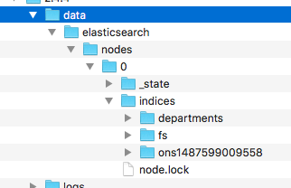

mavenastic
================

A docker image to enable the creation of a ElasticSearch image that contains '_known_' data and a maven and java (JDK) binaries 
so the maven build can run inside this container and reference the '_known_' data.:
#DOCKER IMAGE
The document image is a simple extension of the Maven image and extended with the Elastic Search 2.4.4 binaries.

If Maven needs to know if its running a container (i.e. otherwise it could create a docker instance with ElasticSearch in)
then it can check for the environment variable '__CONTAINER=mavenastic__' which is set during the instantiation of this container.

To rebuild the docker image you need to install ElasticSearch (ES) 2.4.4 (or what ever version you are going to use) and then run the indexing process, this is probably still Zebedee.
>If its Zebedee you can simply start up a new ES delete all the indices and then start Zebedee; the indices will be rebuilt


Once you have built the indices with the data you want then copy the indices data files into the subdirectory `localData`.
Once the data has been copied then run docker  
```docker build -t guidof/onswebsite-search . ```
and this will create an image on your local docker repo.
```bash
fawkej$ docker images
REPOSITORY                 TAG                  IMAGE ID            CREATED             SIZE
guidof/mavenastic          latest               627e06a94f21        5 hours ago         1.39 GB

```

You probably want to tag it with a version number, say `0.0.2` to do this you need to use the `docker tag` command
```bash
docker tag 253eeecee780 guidof/mavenastic 
```
> note the correlation between _IMAGE ID_ and the id after the `tag` command.

once you have a 0.0.2 locally you can then _(once you have logged into Docker)_ push the image into docker.

## Data files
You data files in Elastic will look like this 
.
Copy the `elasticsearch` directory, and all its children, to under the `localData` directory before building the image.


